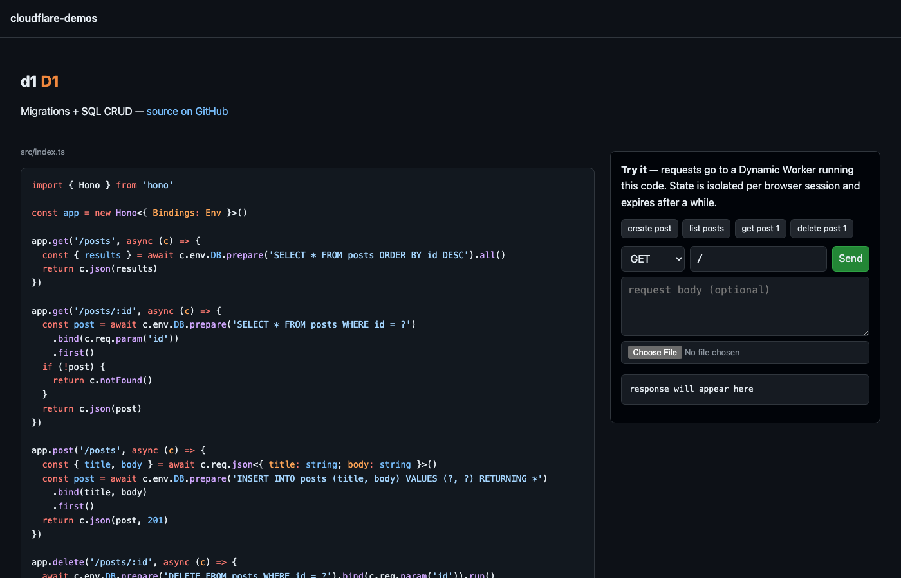

# cloudflare-demos

Minimal Cloudflare product demos — one small [Hono](https://hono.dev)-based
Worker per product.

**▶ Live site: https://cf-demos.yusuke.run** — browse every chapter's code,
and run nine of them right in your browser. Each live chapter executes in a
sandboxed [Dynamic Worker](https://developers.cloudflare.com/dynamic-workers/)
with capability-based bindings, fully isolated per session.

[](https://cf-demos.yusuke.run)

| Chapter                                        | Product           | What it shows                           |
| ---------------------------------------------- | ----------------- | --------------------------------------- |
| [hello-hono](./demos/hello-hono)               | Workers           | Smallest Worker + `request.cf` metadata |
| [kv](./demos/kv)                               | Workers KV        | get / put / delete / list + TTL         |
| [d1](./demos/d1)                               | D1                | Migrations + SQL CRUD                   |
| [durable-objects](./demos/durable-objects)     | Durable Objects   | Per-name object, SQLite storage, RPC    |
| [r2](./demos/r2)                               | R2                | Streaming upload / download             |
| [queues](./demos/queues)                       | Queues            | Producer + consumer in one Worker       |
| [workflows](./demos/workflows)                 | Workflows         | Durable steps, sleep, auto-retry        |
| [cron](./demos/cron)                           | Cron Triggers     | `scheduled()` handler                   |
| [static-assets](./demos/static-assets)         | Static Assets     | Static files + Worker API routes        |
| [service-bindings](./demos/service-bindings)   | Service Bindings  | Worker-to-Worker RPC, zero overhead     |
| [rate-limit](./demos/rate-limit)               | Rate Limiting     | Per-key limits on the edge              |
| [workers-ai](./demos/workers-ai)               | Workers AI        | LLM inference with one binding call     |
| [vectorize](./demos/vectorize)                 | Vectorize         | Semantic search with embeddings         |
| [browser-rendering](./demos/browser-rendering) | Browser Rendering | Headless Chromium screenshot            |
| [images](./demos/images)                       | Images            | Inspect / resize / convert images       |
| [email](./demos/email)                         | Email Service     | Transactional send via `send_email`     |
| [flagship](./demos/flagship)                   | Flagship          | Feature flag evaluation with context    |

## Setup

```sh
pnpm install
```

Each chapter is an independent Worker:

```sh
pnpm -F <chapter> dev
```

See each chapter's README for routes and deploy steps.
